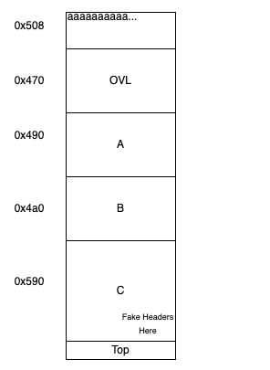
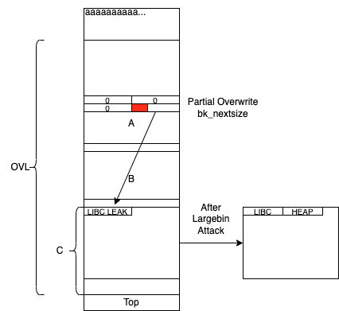

# Too Many Houses

This writeup serves as my solution to the challenge **too many houses** from the US Cyber Open CTF 2022. 
It uses a different method from the intended solution which can be seen in the official github repository [here](https://github.com/tj-oconnor/cyber-open-2022/blob/main/pwn/house/Solution.pdf).
I did not know about the House of Apple technique or the existence of the `mp_` struct inside of libc at the time of the competition but was able to find a completely different way to solve this challenge.

## Overview
It is assumed that the reader has either read through the above linked writeup or has RE'd out the challenge binary's functionality. A quick summary of the key points are as follows:

* This challenge follows the format of a generic menu-driven heap challenge with create, view, edit, and delete functionalities.
* A maximum of 10 chunks may be created with sizes between 0x450 and 0x4000. This implies we need to work with largebin/unsorted bin chunks.
* Both the view and edit functions may only be used once each.
* There is a seccomp filter which blocks pretty much all syscalls other than open, read, write, alarm, and exit.
* The challenge uses libc 2.35 which has gotten rid of `__free_hook` and `__malloc_hook`.

## Exploit Summary
There is a bug in the allocate and edit features due to unsafe usage of strlen and read which allows for the next chunk's size field to be overwritten if the current chunk is allocated with a string of maximum length with a length such as 0x508. This is a typical heap overflow and trivially allows for the creation of overlapping chunks by increasing the next chunk's size.

Using this overlapping chunk and some addition heap feng-shui, I first simultaneously obtained a libc leak and a heap leak by performing an unaligned largebin attack using a partially overwritten `bk_nextsize` field against the heap. As this requires a 4-bit brute force, my exploit only works approximately 1/16 of the time. More details below.

After obtaining both leaks it was simply a matter of implementing a House of Banana exploit, which involved using a second largebin attack to overwrite the `_rtld_global._dl_ns[0]._ns_loaded` pointer to a heap pointer where there is a forged `link_map` object. Once the overwrite is successful, all that is needed is to wait for the alarm which will call exit and eventually call a setcontext gadget to pivot the stack to an ORW ROP chain on the heap.

## Exploit Details
The actual steps taken are as follows. Note the sizes here don't actually have to be exactly as stated, they are just what I used for my final exploit.

1. First, allocate a chunk of size 0x508 which will cause the overflow. Fill with 'a's. (Chunk #0)
2. Allocate 4 chunks of sizes 0x460, 0x480, 0x490, and 0x580 respectively (Chunks #1-4. Call these OVL, A, B, and C. The size of OVL will be overwritten later with the overflow. C includes some fake next size values which will used to pass checks for OVL and later C itself.

The expected layout at this point is as follows:

3. Then, use the edit to overwrite OVL's size such that it overlaps A, B, and C; here I used size 0x1280. 
4. Free OVL.
5. Allocate chunk #5 such that OVL is reused and split right where C starts. This places a libc address right at the beginning of C as the remainder is put into unsorted bin. Also, simultaneously overwrite A and B to be slightly smaller and non-continguous to prevent their consolidation when freeing later.

6. Free #5 so that OVL re-consolidates back. 
7. Free A. 
8. Allocate chunk #6 with a size greater than A to place the freed A chunk into largebin from unsorted bin. This will populate A's `fd_nextsize` and `bk_nextsize` fields. Simultaneously perform a partial overwrite of the `bk_nextsize` pointer, making it point to `C+6-0x20`. This is 0x20 bytes before the address immediately after the libc leak which was written in earlier, and is the target for the first largebin attack which will take place a bit later.
Note that this step necessitates a 4-bit brute force, as the low 3 nibbles are constant but the 4th is not. 
9. Free #6, re-consolidating OVL yet again.
10. Free B, placing it into unsorted bin.
11. Allocate #7 to be larger than B, placing B into largebin and launching the first largebin attack. Because of the earlier partial overwrite, this will write a heap address immediately after the libc leak in C.

This should all look like the following:

12. Get both a libc leak and heap leak by viewing C. Once we get both leaks it's fairly straightforward to do a House of Banana attack.
13. Free #7, re-consolidating OVL for the third time.
14. Allocate #8, this time overwriting all of A, B, and C. The most important thing here is to overwrite `A->bk_nextsize` to point to `_rtld_global-0x20` as House of Banana requires. Also, overwrite C's size to be 0x440 so that it will be placed in the correct largebin freelist for the second largebin attack.
In addition to this, I also chose to restore all of the other fd/bk/fd_nextsize/bk_nextsize pointers for A and B here are well, although I don't know how much of this was necessary. 
15. Free #8, consolidating OVL for the final time.
16. Free C.
17. Allocate #9 to overlap up to C's contents, triggering the second largebin attack against `_rtld_global` as C gets moved from unsorted bin to largebin. Write in the ROP chain and forged `link_map` object at the appropriate addresses, primarily inside of C. I referenced [this Japanese writeup](https://qiita.com/kusano_k/items/2e8bf933bff37c0e98e0) of a similar heap challenge for this part of the exploit relating to the `link_map` struct.
18. Wait for the timer to fire, which will call exit and eventually call the ROP chain to open, read, and write the flag file.

Please reference the `solve.py` script to see further details. 

## Minor Issues
There were a couple of issues I encountered when writing my exploit. The first was that the remote environment did not have the same linker offset as my local setup and the second was that there was some network latency which prevented some of the reads from finishing properly. The first was resolved when the CTF organizers provided a Dockerfile, but the second required that I refactor my code to use the sizes used in my final exploit. Any size greater than the ones used would fail since the remote service would prematurely finish reading anything larger than 0x1500 bytes or so. Even after using the smaller sizes it still failed about 50% of the time for an unknown reason against remote. This issue never arose during local testing so it must be some sort of network issue.

